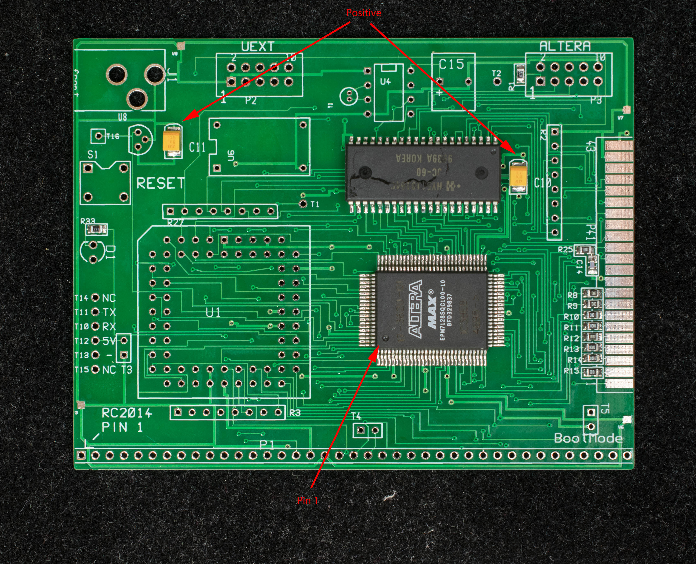
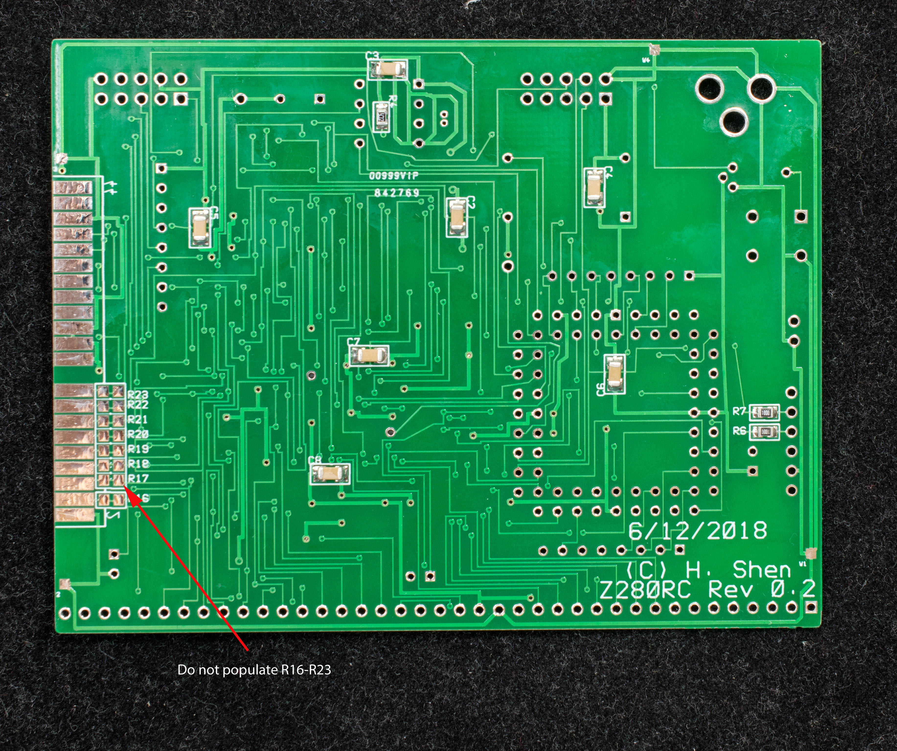
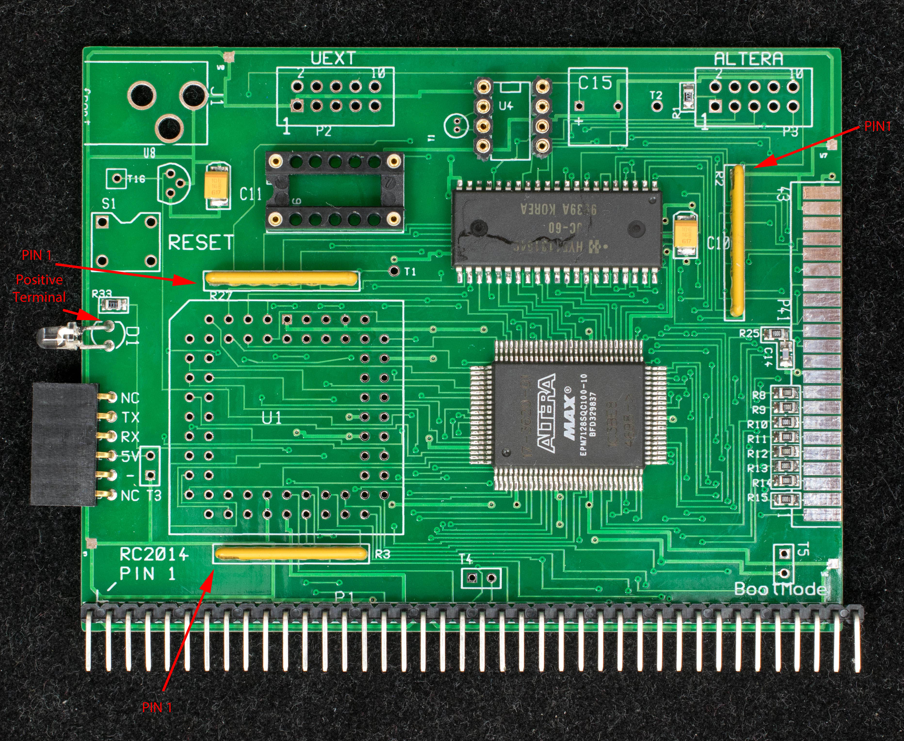
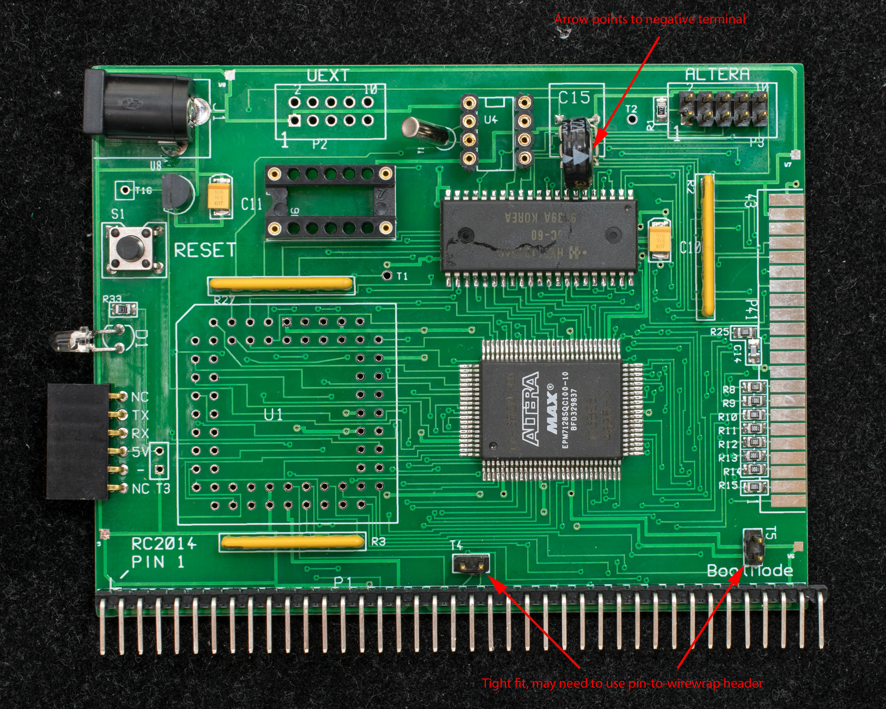

# Z280RC Pictorial Assembly Guide

This is a step-by-step guide for assembly of Z280RC.

1. Assemble EPM7128SQC100 and HY5118164 first, followed by SMD capacitors and resistors. Observe the polarity marks of the SMD capacitors.

2. Install SMD capacitors and resistors on the solder side. Do not install R16-R23.

3. Install 1×6 serial port connector, LED, SIP resistors and IC sockets.

4. Install super capacitor, 2.1mm x 5.5mm jack, voltage supervisor, clock crystal and reset button. The arrow marking on the super capacitor points at the negative terminal.

5. Install the 68-pin PLCC socket. The mitred corner of the socket should match the silkscreen.

www.retrobrewcomputers.org_lib_plugins_ckgedit_fckeditor_userfiles_image_builderpages_plasmo_z280rc_dsc_37600901_copy.jpg

6. Do not populate the board with Z280 nor oscillator. First connect Altera programming cable to the 2×5 header and power up the board. Program the Altera CPLD and verify the part is correctly programed.

7. Populate Z280 and 29.49MHz oscillator. Connect CP2102 USB-serial adapter to the serial port, do not jumper T5 (Bootstrap), set terminal software to 115200, odd parity, 8 data bit, 1 stop and no handshake. Set delay-per-line to 1 millisecond. Power up the board and send the file “loadngo.hex”. If terminal displays several lines of dots followed by a sign-on message, proceed to step 8.

www.retrobrewcomputers.org_lib_plugins_ckgedit_fckeditor_userfiles_image_builderpages_plasmo_z280rc_dsc_37620901_copy.jpg

8. Solder the 44-pin CF adapter. This completes the assembly of Z280RC.

www.retrobrewcomputers.org_lib_plugins_ckgedit_fckeditor_userfiles_image_builderpages_plasmo_z280rc_dsc_37630901_copy.jpg

www.retrobrewcomputers.org_lib_plugins_ckgedit_fckeditor_userfiles_image_builderpages_plasmo_z280rc_dsc_37640901.jpg
