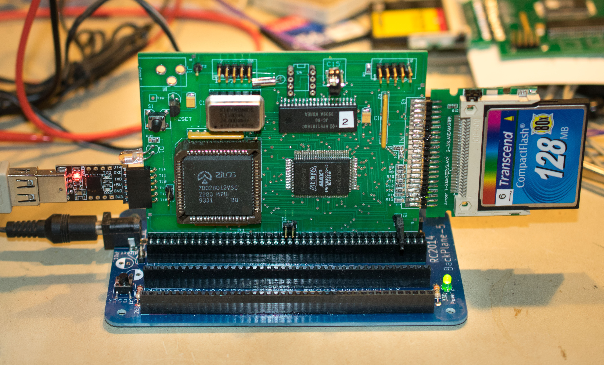
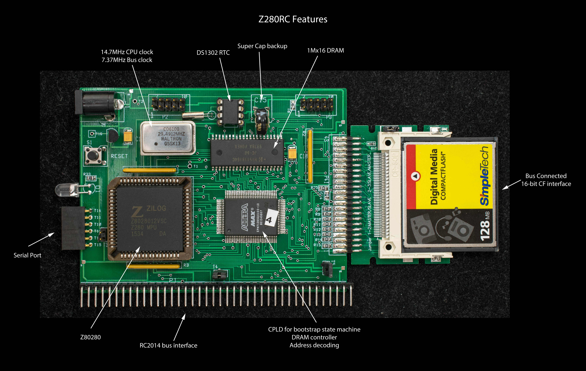
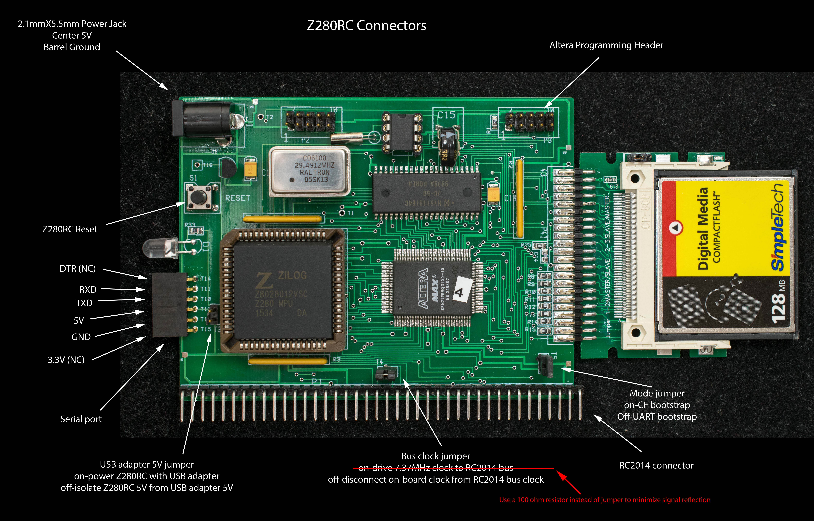

# Z280RC
A CP/M-ready, Z280-based SBC for RC2014 bus
## Introduction

Z280RC (Z280 for RC2014) is a single-board Z280 computer with I/O expansion connector compatible with RC2014 bus. It is derived from [TinyZ280](https://www.retrobrewcomputers.org/doku.php?id=builderpages:plasmo:tinyz280:final_step) but instead of the SIMM72 DRAM module, a 1megx16 DRAM is used. It also have an interface to the [RC2014](https://rc2014.co.uk/) backplane. The interface to RC2014 is limited to its I/O modules. This is because the higher order addresses of RC2014 bus, A8-A15, and Memory Request (nMREQ) control line are not connected. The reason is because Z280RC already have internal RAM and shadow boot ROM so external memory interface is unnecessary.

***
## Features

* Z280 CPU running at 29.49MHz with bus speed of 7.37 MHz
* 2 megbyte of DRAM
* RAM-only system, shadow ROM is stored in CF disk and loaded in RAM at power-on or reset
* Bus-connected 16-bit-wide CF interface
* RTC based on DS1302
* Four 8-meg CF drives (A: to D:)
* 1.5-meg RAM drive (E:)
* One internal UART at 115200 baud, odd parity, no handshake
* bootstrap from CF disk to ZZMon, a simple monitor
* CP/M 2.2
* CP/M 3 non-banked
* A standalone single-board computer with I/O expansion bus compatible with RC2014 I/O bus

***

## Modes of Operation

Z280RC has two modes of operation as determined by the mode jumper (T5) at power up (see picture below for location of mode jumper). Jumper removed set the UART bootstrap mode; jumper inserted set the CF bootstrap mode.
### UART Bootstrap

At power up the Z280 CPU is held in idle state until 256 bytes of instruction is uploaded to UART (115200 baud, odd parity, and no handshake) which is then copied to memory starting from location 0x0. Afterward the CPU starts execution from 0x0. In UART bootstrap mode, the program “LoadnGo.run” is send to the UART. LoadnGo contains a 256 bytes binary file that loads the following ZZMon in Intel Hex format and then jump to the starting address of ZZMon. This is the mode to initialize a new CF disk. The cold bootstrap code is written to boot sector and ZZMon itself is written to track 0 of CF in this mode. All the functions of ZZMon is accessible in UART bootstrap mode.
### CF Bootstrap

This is normal mode of operation. At powerup, the state machine in CPLD initializes the CF to access cold bootstrap code stored in the boot sector and map the memory from 0x0-0x1FF to the data register of CF. Once the boot sector data is loaded into the 512-byte FIFO of CF data register, the state machine releases the reset of Z280 which then executes a two-stage bootstrapping operations:

1. Z280 executes the cold bootstrap code which copies a small CF loading program into memory and then jump into the CF loading program.

2. The CF loading program loads the monitor, ZZMon, from CF disk into memory and jump to ZZMon. ZZMon will display a sign-on message and wait for user inputs. Refer to [ZZMon manual](Manuals/ZZMon_manual.md) for details.

Here is a more detailed description of the [CF bootstrap operation](How%20Z280RC%20bootstraps%20from%20CF.md).

## Design Files

Z280RC schematic annotated with engineering changes

Gerber photoplots. The boards were manufactured by Seeed Studio

Bill of Material for Z280RC

Engineering Changes

Pictorial assembly guide

Altera EPM7128 CPLD design file for 29.4912MHz system clock. Altera EPM7128SQC100 programming file for 29.4912MHz system clock.

### Software

    ZZMon – monitor rev 0.99 for Z280RC. Assembled with Zilog ZDS v3.68
    LoadnGo – load file to start up ZZMon in UART bootstrap mode
    CP/M2.2, CPM22ALL to be assembled with Zilog ZDS v3.68. This is the entire CP/M2.2 including BDOS, CCP, and BIOS
    CP/M2.2 Intel Hex load file to be loaded by ZZMon at location 0xDC00-0xFFFF and then copy to CF track 0 using the 'C2' command
    CP/M3 LDRBIOS to be assembled with ZMAC into LDRBIOS.REL and then linked in CP/M as follow: LINK CPMLDR[L100]=CPMLDR, LDRBIOS
    CP/M3 CBIOS3 (non-banked) to be assembled with ZMAC into CBIOS3.REL and then linked in CP/M as follow: LINK BIOS3[OS]=CBIOS3,SCB
    CP/M3 CPMLDR.COM linked to 0x1100. This is an Intel Hex file to be loaded by ZZMon at location 0x1100 and copy to CF track 0 using the 'C3' command
    CP/M2.2 DRI distribution image
    CP/M3 distribution image
    SC Monitor by Steve Cousins can be downloaded from here. Instruction to customize SC Monitor for Z280RC and load it into CF disk for fast startup.
    DS1302 test software. These are test software to demonstrate the DS1302 RTC is operating properly. bitbangRTC1st should be run first to enable the super capacitor charging circuit and to set the time. bitbangRTC is used to read the RTC afterward. These test software were assembled using zmac

### Manual

    [Getting Started](Manuals/GettingStartedGuide.md) Guide
    [ZZMon](Manuals/ZZMon_manual.md) operating manual
    Create a new CF disk for Z280RC

### Reference

    Z280 Technical Manual
    DS1302 data sheet
    HY5118164 1meg x 16 EDO DRAM

