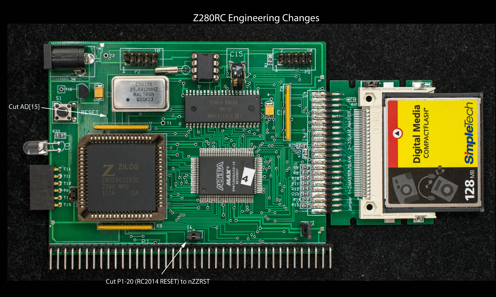
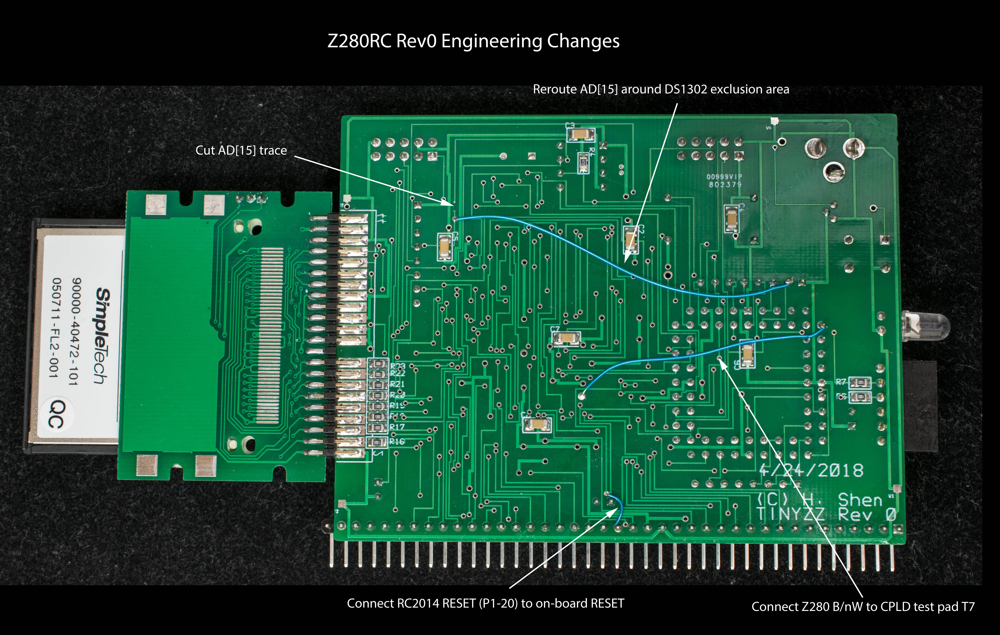

# Z280RC Rev 0 Engineering Changes

The Z280RC schematic contains annotated Engineering Changes. However, there are additional changes that are not described in the schematic. There are traces cuts on the component side of the pc board and additional cuts and jumpers on the solder side of the pc board. Below are photographs of the pc board showing the locations of cuts and jumpers.

Summary of the EC:

* Hook up Z280's B/nW signal to CPLD spare test pad T7.
* RC2014 RESET pin (P1-pin 20) connects to on-board RESET signal instead of nZZRST
* Cut and reroute AD[15] signal that was in the exclusion area of DS1302 RTC

